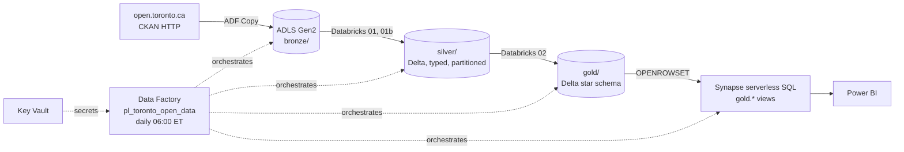

# Architecture

## Medallion layers

| Layer | Format | Grain | Who writes | Rule |
|---|---|---|---|---|
| bronze | CSV as downloaded, `table/run_date/` | source | Data Factory | never modified; a new run_date folder per day |
| silver | Delta, partitioned by `occurrence_year` | one row per offence per event | notebook 01 / 01b | typed, trimmed, de-duplicated; data-quality asserts fail the job |
| gold | Delta | star schema + aggregates | notebook 02 | business rules (2014 cut-off, rate per 1,000) live here only |

## Cost profile

Everything is pay-per-use or free tier: ADLS LRS (cents), ADF (a few pipeline runs a day), Databricks
job cluster of one `Standard_DS3_v2` for ~5 minutes/day, Synapse **serverless** (no dedicated pool, billed per TB scanned;
the gold tables are ~40 MB). Expect well under CAD $10/month. Tear down with `az group delete -n rg-toronto-data`.

## Security

- No keys anywhere: Data Factory and Synapse use system-assigned managed identities, granted
  Storage Blob Data Contributor on the lake in Bicep.
- Storage: HNS on, public blob access off, TLS 1.2 minimum.
- Key Vault with RBAC authorization for the Synapse SQL admin password.
